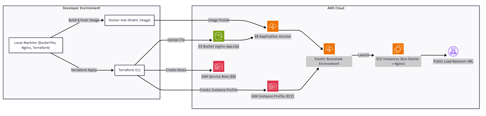

# Nginx Docker on AWS Elastic Beanstalk Project

## Project Motivation

I built this project to address a common challenge in modern organizations: deploying applications reliably and consistently in the cloud. Many companies struggle with manual configurations, inconsistent environments, and deployments that are hard to reproduce.

To solve this, I created an automated deployment using AWS Elastic Beanstalk, Docker, and Terraform. The project deploys a containerized Nginx application using Infrastructure as Code, ensuring that the entire environment is created, configured, and updated automatically.

This project demonstrates how automation, containerization, and cloud services work together to improve scalability, reduce errors, and streamline operations. It also helped me strengthen practical skills in AWS, Docker, and Terraform that are directly applicable to real enterprise cloud environments.

---

## Project Overview

This project demonstrates how to deploy a Dockerized Nginx web application on AWS Elastic Beanstalk using Terraform for infrastructure as code.

### Architecture Overview


*This architecture diagram was created using **MermaidChart** ([https://www.mermaidchart.com](https://www.mermaidchart.com)).*

The architecture consists of:

* **Elastic Beanstalk Environment**: Hosts the Docker container running Nginx.
* **S3 Bucket**: Stores application versions (zip files containing `Dockerrun.aws.json`).
* **Terraform**: Configures and deploys all AWS resources automatically.
* **Docker Hub**: Stores the Docker image for Nginx with the website.

---

## Table of Contents

1. [Project Motivation](#project-motivation)
2. [Architecture Overview](#architecture-overview)
3. [Screenshots](#screenshots)
4. [Prerequisites](#prerequisites)
5. [Project Setup](#project-setup)
6. [Terraform Configuration](#terraform-configuration)
7. [Docker Image](#docker-image)
8. [Deploying the Application](#deploying-the-application)
9. [Testing the Deployment](#testing-the-deployment)
10. [Terraform Workflow](#terraform-workflow)
11. [Cleanup](#cleanup)
12. [References](#references)

---

## Prerequisites

* AWS account with permissions for Elastic Beanstalk, S3, and IAM.
* Terraform installed.
* Docker installed and configured locally.
* Docker Hub account for storing images (optional for this project).
* Git and GitHub for version control.

---

## Installing Terraform

1. Download Terraform from [Terraform Downloads](https://developer.hashicorp.com/terraform/downloads) and add it to your PATH.
2. Verify installation:

```bash
terraform -v
```

---

## Project Setup

1. Create project folder:

```bash
mkdir AWS_projects/nginx-docker-terraform
cd AWS_projects/nginx-docker-terraform
```

2. Create a Dockerfile for Nginx (already includes your website):

```dockerfile
FROM nginx:latest
COPY . /usr/share/nginx/html
```

3. Create Terraform files: `main.tf`, `variables.tf`, and `outputs.tf`.
4. Create a zip file containing `Dockerrun.aws.json` for Elastic Beanstalk:

```json
{
  "AWSEBDockerrunVersion": "1",
  "Image": {
    "Name": "xav519/nginx-docker-terraform:latest",
    "Update": "true"
  },
  "Ports": [
    {
      "ContainerPort": "80"
    }
  ]
}
```

> **Note:** The zip file does **not** need to include your website content. Your Docker image already contains the HTML website. The zip is only needed so Elastic Beanstalk knows which Docker image to pull and how to configure the container.

---

## Terraform Configuration

Terraform provisions:

* **S3 Bucket**: For storing the application zip.
* **Elastic Beanstalk Application**: Nginx deployment container.
* **Elastic Beanstalk Environment**: Public-facing load-balanced environment.
* **Docker Pull from Docker Hub**: Elastic Beanstalk pulls the image automatically.

---

## Docker Image

For this project, I created a Docker image locally with the website and uploaded it to Docker Hub:

1. **Build Docker image locally**:

```bash
docker build -t xav519/nginx-docker-terraform:latest .
```

2. **Log in to Docker Hub**:

```bash
docker login -u xav519
```

3. **Push image to public Docker Hub repository**:

```bash
docker push xav519/nginx-docker-terraform:latest
```

The image is publicly available at `xav519/nginx-docker-terraform`, allowing AWS Elastic Beanstalk to pull it directly.

> **Important:** You do **not** need to build or push the Docker image yourself. Terraform and Elastic Beanstalk will pull the public Docker image automatically. The zip file is still required for EB deployment.

---

## Deploying the Application

1. Initialize Terraform:

```bash
terraform init
```

2. Plan resources:

```bash
terraform plan
```

3. Apply resources:

```bash
terraform apply
```

Confirm with `yes` when prompted.

---

## Testing the Deployment

1. After Terraform finishes, access the public URL generated by Elastic Beanstalk:


2. You should see your website:


---

## Terraform Workflow

1. Terraform provisions all AWS resources, including:

   * S3 bucket for zip file
   * Elastic Beanstalk application and environment
   * Pulling Docker image from Docker Hub

2. Deployment is fully automated and reproducible using Infrastructure as Code.

---

## Cleanup

To remove all resources:

```bash
terraform destroy
```

---

## References

* HashiCorp. Terraform Documentation. Retrieved from [https://developer.hashicorp.com/terraform/docs](https://developer.hashicorp.com/terraform/docs)
* Amazon Web Services. AWS Elastic Beanstalk Documentation. Retrieved from [https://docs.aws.amazon.com/elasticbeanstalk/latest/dg/](https://docs.aws.amazon.com/elasticbeanstalk/latest/dg/)
* Amazon Web Services. AWS S3 Documentation. Retrieved from [https://docs.aws.amazon.com/s3/index.html](https://docs.aws.amazon.com/s3/index.html)
* Docker. Docker Documentation. Retrieved from [https://docs.docker.com/](https://docs.docker.com/)
* OpenAI. ChatGPT (GPT-4/5 Model). Retrieved from [https://chat.openai.com](https://chat.openai.com)
* Terraform registry** AWS Provider. Retrieved from [https://registry.terraform.io/providers/hashicorp/aws/latest/docs](https://registry.terraform.io/providers/hashicorp/aws/latest/docs)

---

— Xavier Dupuis
